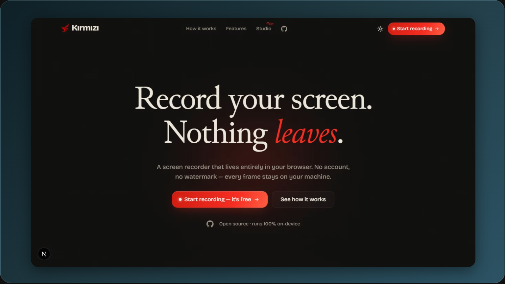
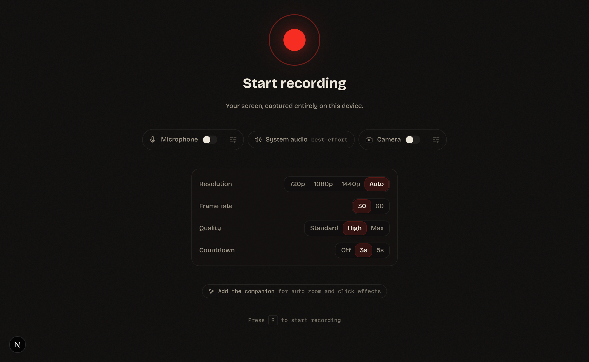
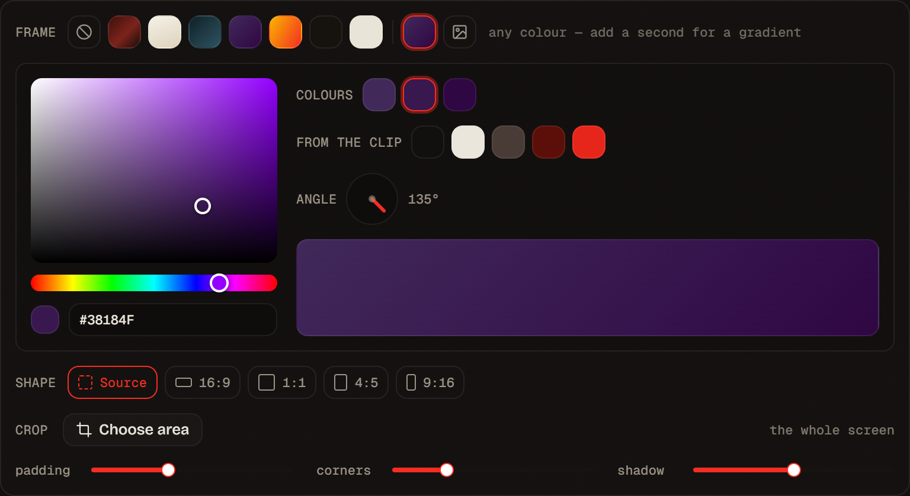
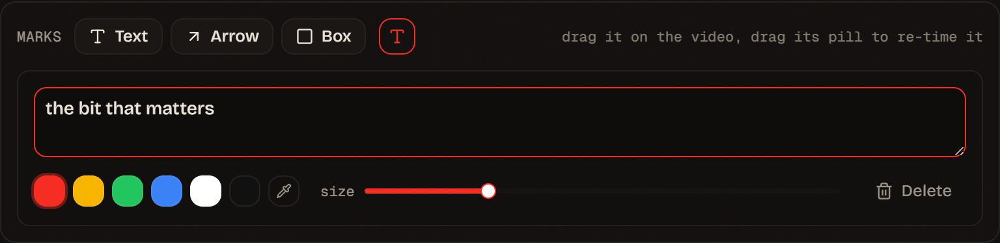

<div align="center">

<picture>
  <source media="(prefers-color-scheme: dark)" srcset=".github/media/lockup-onDark.svg" />
  
</picture>

### Record your screen. Nothing leaves your browser.

No account, no upload, no watermark, no time limit.<br />
The file is built on your machine and saved from there.

**[Start recording →](https://kirmizi.app)**

<br />



</div>

<br />

Most screen recorders want you to sign in, hand the take to a server you don't
own, and give back a link with a badge in the corner. This one is the other
arrangement: the browser captures the screen, cuts it, encodes the file, and the
download comes off your own disk.

That isn't a line in a privacy policy. **There is no endpoint that could receive a
recording** — the server hands over a page and nothing else. No database, no
accounts, no media storage, nothing that would need a policy to explain.

## It starts here

<table>
<tr>
<td width="46%" valign="top">

Resolution, frame rate, quality and countdown, then the button. Microphone and
camera are toggles rather than a wizard, and system audio is taken when the
browser will give it.

There is no landing page in front of the recorder — `/record` opens on this.

The webcam records as **its own track**, so the bubble can be moved, resized and
restyled afterwards instead of being burned into the picture at capture time.

</td>
<td width="54%" valign="top">



</td>
</tr>
</table>

## The work survives the tab

Recording locally used to mean losing everything to an accidental reload. The last
**five** recordings and every edit made to them are kept in the browser's own
IndexedDB, so closing the tab and coming back finds the timeline where you left
it — the cuts, the zooms, the frame, the marks.

Local and persistent are not opposites. Nothing is uploaded either way.

## Every frame is drawn exactly once

The obvious way to export an edited clip is to play it back and record the result.
It works, it costs a minute of real time per minute of video, and it drops
whatever frames the machine was too busy to draw — so the same export comes out
differently twice.

Kırmızı decodes the recording's samples through **WebCodecs**, draws each one
through the scene renderer, and encodes it. Nothing plays, nothing is watched,
nothing can be dropped.

> A 26-second 1280×720 clip exports in about **two seconds**.

Firefox has no mp4 encoder, so `MediaRecorder` there writes WebM. The same path is
open to it through a streaming EBML reader built for what MediaRecorder actually
produces — Segments and Clusters of unknown size, a declared duration of zero, no
index. Firefox went from playback speed to roughly **6× faster than the clip is
long**, and from `.webm` to `.mp4`.

## Then you dress it

<table>
<tr>
<td width="54%" valign="top">



</td>
<td width="46%" valign="top">

A background, padding, rounded corners, a shadow — rendered into the file, not
faked in the preview.

The presets are **starting points, not a menu**. Take one, turn the angle, change
a colour, and it's yours. One colour is a flat background; adding a second makes
it a gradient. Or drop in a picture.

**From the clip** offers the colours the recording is actually made of, so the
frame can match what's inside it.

</td>
</tr>
</table>

## And mark it

<table>
<tr>
<td width="46%" valign="top">

Text, arrows and boxes, each a timed region on the timeline like a zoom.

A mark's position lives in the **capture's own coordinates**, so an arrow keeps
pointing at the button through a crop, a reframe and a zoom. Its size is measured
against the frame instead — a label that tripled inside a 3× push-in would be no
use to anyone.

</td>
<td width="54%" valign="top">



</td>
</tr>
</table>

## The rest of the edit

| | |
| --- | --- |
| **Cut** | A filmstrip timeline, multi-cut, per-segment mute and speed. A trim with no other edit copies the video stream rather than re-encoding it, so the picture is untouched. |
| **Dead air** | Silence alone is a bad signal — you pause while the screen is busy. Two signals have to agree, quiet **and** still, before a stretch is offered as a cut. |
| **Zoom** | Timed push-ins with eased ramps, aimed by dragging on the preview. With the companion they're proposed from where you actually clicked. |
| **Crop & shape** | The screen is captured whole because that's all the browser offers; choose the part that matters afterwards, and the shape to publish it in — 16:9, 1:1, 4:5, 9:16. |
| **Sound** | Levels are measured, not guessed: [EBU R128](https://tech.ebu.ch/publications/r128) loudness to −16 LUFS under a −1 dBTP ceiling. |

**Recording** — <kbd>R</kbd> start · <kbd>S</kbd> stop · <kbd>Space</kbd> pause  
**Editing** — <kbd>Space</kbd> play · <kbd>S</kbd> split · <kbd>Z</kbd> zoom · <kbd>M</kbd> mute · <kbd>Del</kbd> remove · <kbd>Ctrl</kbd>+<kbd>Z</kbd> undo

## The companion extension

A web page cannot watch the pointer on surfaces it doesn't own — a deliberate
browser boundary, and a good one. `getDisplayMedia` hands over pixels, never
events. So click marks and auto zoom need something inside the page being
recorded, and that something is one small optional extension.

**[Kırmızı Companion on the Chrome Web Store →](https://chromewebstore.google.com/detail/kirmizi-companion/dffcgjfcmhcianhbahkmajigonlmbdaj)**

It keeps pointer positions and click times in memory, hands them to your own
kirmizi.app tab when the recording stops, and forgets them. No storage, no network
access, and nothing about the pages you visit — no URL, no content, no element.
Without it, everything else works exactly as before.

## Run it

```bash
bun install
bun dev     # http://localhost:3000
bun test    # the maths: timeline, geometry, loudness, stored edits
```

`getDisplayMedia` needs a secure context, so recording works on `localhost` and
over HTTPS. The pure logic is covered by **232 tests** that run in well under a
second; anything touching an `AudioContext`, WebCodecs or the DOM is checked in a
real browser instead.

## How it is built

| | |
| --- | --- |
| **Next.js** · TypeScript · Tailwind | One project: a landing page and the recorder |
| `getDisplayMedia` · `getUserMedia` | Screen, window or tab capture, and the microphone |
| **WebCodecs** + [mp4box](https://github.com/gpac/mp4box.js) + [mp4-muxer](https://github.com/Vanilagy/mp4-muxer) | Demux, decode, re-encode, mux — the frame-exact export |
| `<canvas>` · `captureStream` · `MediaRecorder` | Capture, and the fallback export |
| Web Audio (`OfflineAudioContext`) | Loudness measurement and the finished soundtrack |
| IndexedDB | The last few recordings and their edits |
| [ffmpeg.wasm](https://github.com/ffmpegwasm/ffmpeg.wasm) | Lossless trims, and AAC where the browser can't encode it |

Chrome, Edge and Firefox all get the frame-exact export. Safari's implementation
is partial; the app feature-detects what it needs and says so where something is
missing rather than failing halfway through.

## License

[MIT](./LICENSE) — Copyright © 2026 canbedir.

The code is MIT; the Kırmızı mark and wordmark are not.
